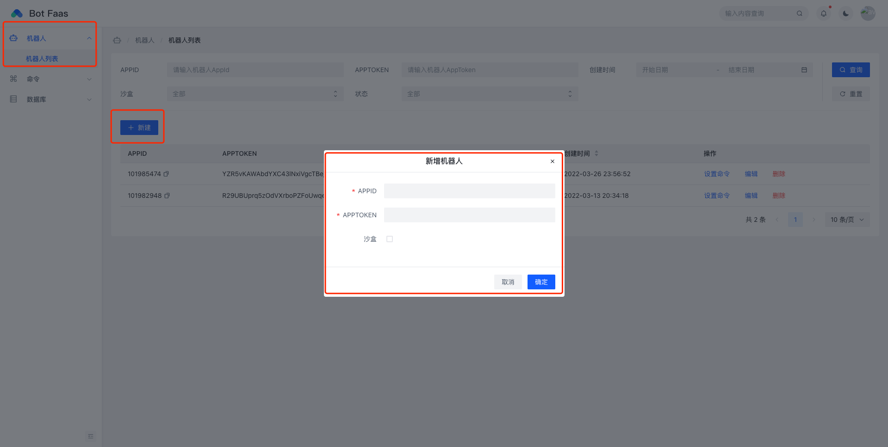
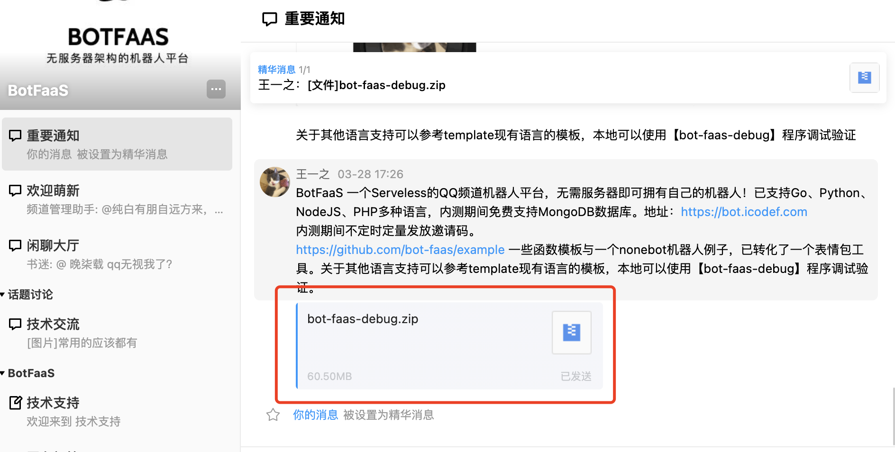
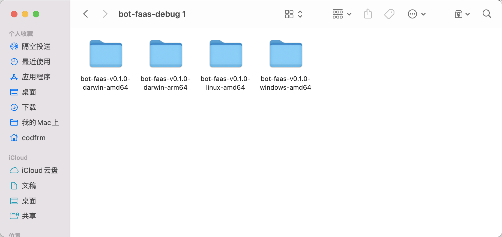
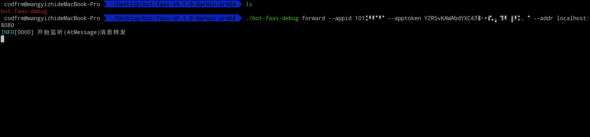
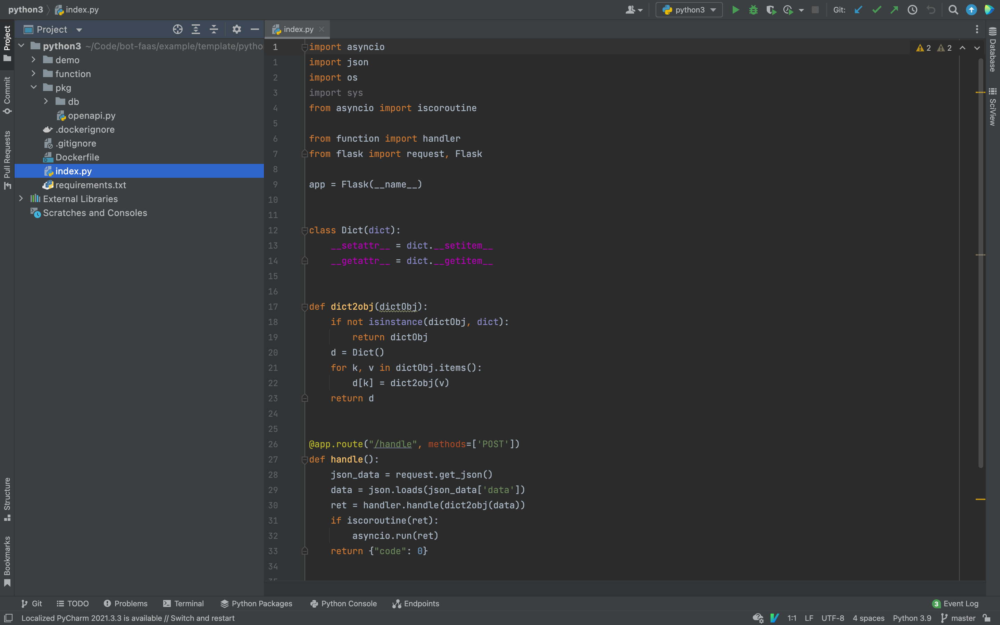
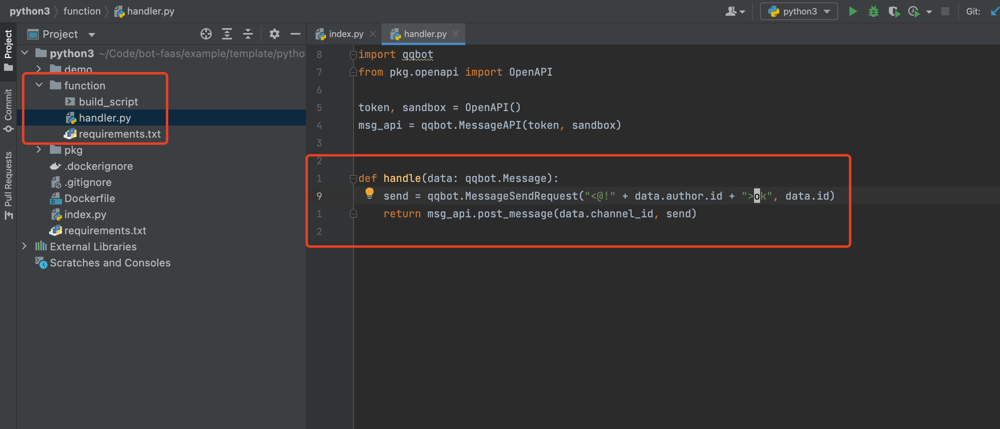
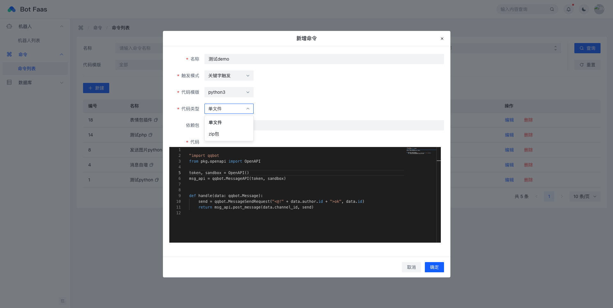
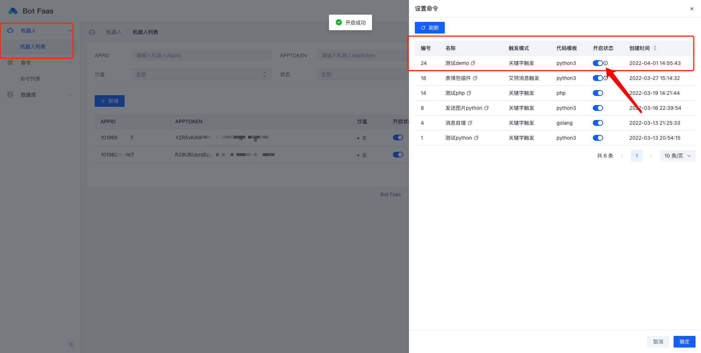

## 函数模板

支持语言如下：

* go 1.16
* node 16
* python 3.9
* php 7.4

## 开发流程

1. 在平台上添加机器人
   

2. 在频道中下载本地调试程序【bot-faas-debug】

   

3. 解压后选择适合自己系统的版本，如果没有或者无法运行可在频道中反馈（例如Windows amd64选择【bot-faas-v0.1.0-windows-amd64】）

   

4. 打开命令行终端，进入相对应的文件夹，执行命令启动debug程序，可以参考[启动调试](#启动调试)

   

5. 选择一个模板，例如我这里是python，使用对应的IDE打开，我这里选择的是PyCharm，同时请记得安装好所需要的依赖

   

6. 参考[环境变量配置](#环境变量配置)中的IDEA配置好环境变量，点击进入function目录开始开发，handler/handle函数为入口函数

   

7. 然后点击IDE的debug按钮就可以开始在本地调试啦

8. 在本地开发完成后将函数上传至平台，如果你只有修改handler一个文件，只需要将handler文件复制粘贴至平台编辑框中，如果是一个项目，请将代码类型选择为zip包，将function文件夹打包成zip上传至平台；如果包含了一些其它的依赖可能还需要进行一些其他操作。

   

9. 进入机器人列表页面，点击设置命令，给机器人开启命令，然后就可以在频道中快乐玩耍啦

   

   


## 本地调试

### 环境变量配置

运行时会读取环境变量中的值，用于调用sdk等操作，可以在运行前先执行如下命令：

**Windows**

```powershell
set APP_ID=xxxx
set APP_TOKEN=xxxx
set SANDBOX_BOT=true
set HOME_URL=https://bot.icodef.com
```

**Linux**

```bash
export APP_ID=xxxx
export APP_TOKEN=xxxx
export SANDBOX_BOT=true
export HOME_URL=https://bot.icodef.com
```

建议写成脚本放在模板目录下

**IDEA**

如果是使用IDE，可以在IDE中进行配置，以Goland举例：

点击`Edit Configurations...`进入配置


点击环境变量的编辑按钮


输入环境变量


### 启动调试
> bot-faas-debug程序将在[BotFaaS](https://qun.qq.com/qqweb/qunpro/share?_wv=3&_wwv=128&appChannel=share&inviteCode=aVNjt&appChannel=share&businessType=9&from=181074&biz=ka&shareSource=5)频道中发布，也可以在本频道中获取相关资讯与技术支持。

首先需要启动机器人等消息转发程序，请注意该机器人需要在平台上添加且运行

```bash
./bot-faas-debug forward --appid xxx --apptoken xxx --sandbox --addr localhost:8080
```

其中addr是本地调试函数执行的http地址，模板中默认使用8080端口接收消息，默认只会转发AtMessage消息事件，更多详情可使用`--help`查看详情


### 开发
> 请注意函数是无状态的，请不要写入有状态数据，有状态数据可以存放在平台提供的数据库中。

使用本地调试模板时，请以`function`目录为开发目录，`handler/Handle`方法为入口方法（具体内容请参考语言的模板文件），在平台提交单文件模式的代码也为`handler/Handle`的代码。

如果是完整的项目请将整个`function`文件夹压缩为zip进行上传，同时也需要存在语言的包声明文件：php(composer.json)、python(requirements.txt)、node(package.json)，同目录下的build_script为构建时的脚本，如果某些依赖包依赖一些系统组建可以使用此脚本文件进行安装，另外推荐在此文件设置中使用国内镜像源，加快构建速度。

本地调试，请使用函数模板下的`index`文件启动函数，其中`demo`文件夹是一些函数的示例，`pkg`文件夹是平台内置的一些函数，用于获取数据库、sdk等操作。

如果是项目级别的代码，由于构建与安装依赖会消耗很长时间与资源，请在本地使用Docker构建并正常运行成功后再在平台上进行发布。

### 数据库

如果需要使用数据库请自行在本地配置，默认的函数模板使用数据库需要配置两个环境变量分别是：

* BOT_FAAS_MONGODB_URI # MongoDB的链接URI
* BOT_FAAS_MONGODB_DBNAME # MongoDB的链接数据库名字

配置方法请参考[本地调试](#本地调试)


## 依赖

如果插件有依赖，可以在相对应的function文件夹的包管理文件添加依赖，如果是系统的一些lib可以修改build_script文件，执行命令进行安装。设置好之后，推荐在本地使用Docker构建一次镜像验证，防止在平台构建失败耗时。
